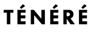
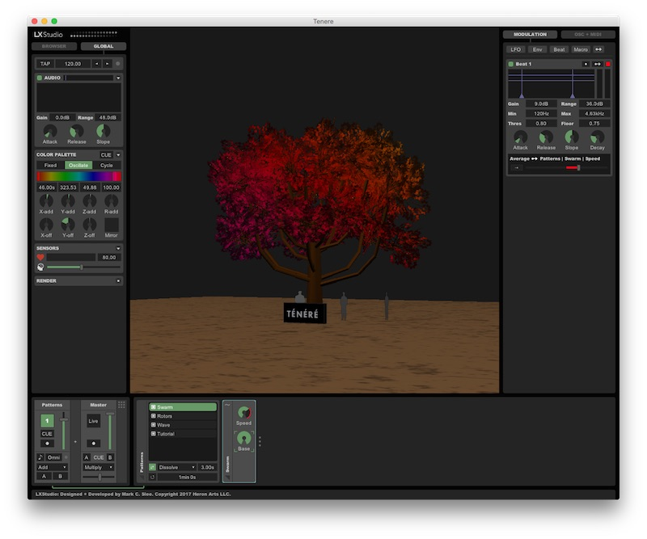

Welcome to the Ténéré technology platform. We're glad you're here!

Ténéré is a dazzling, lifelike tree with 25,000 LED leaves - an an interactive and collaborative artwork built on an open technology platform. It will make its debut at the 2017 Burning Man Festival in Black Rock City, NV.

* [Official Project Site](https://www.treeoftenere.com/)
* [Support Ténéré on Indiegogo](https://www.indiegogo.com/projects/tree-of-tenere-burning-man-2017-and-beyond-art)

## Get Involved

There are lots of ways to get involved in the Ténéré effort! Whether you're a low-level hardware hacker, a visual artist,  or a blockchain guru, there's a place for you to contribute.

### Visual Animation

Always dreamed of developing visual content for a 36-foot tree with lots of LEDs? You're in luck! Ténéré is just the place.

#### For Coders - [Tenere LX](https://github.com/treeoftenere/Tenere)

Comfortable with basic coding? Dive in to the [Tenere](https://github.com/treeoftenere/Tenere) project. This is a completely open-source animation engine built on the [LX Studio](https://github.com/heronarts/P3LX) framework. It all runs in the [Processing](https://processing.org/) environment, an excellent platform for creative coding and easy to integrate with many existing tools.

##### Action items
* Design and implement new pattern-based visual routines for the tree
* Implement custom controller or sensor integrations
* Build and choreograph lighting performances using the tools

Dive in, the leaves are warm: <https://github.com/treeoftenere/Tenere>

#### For Non-Coders - [Stellar](https://github.com/treeoftenere/Stellar)

Interested in experimenting with artistic content for Ténéré, but not so comfortable with code? [Stellar](https://github.com/treeoftenere/Stellar) is a proprietary animation engine built by [Symmetry Labs](http://symmetrylabs.com/), which offers a set tools that enable code-free content-creation!

Swing on by: <https://github.com/treeoftenere/Stellar>

### [Systems + Sensors](https://github.com/treeoftenere/Interactivity)

Are you a low-level hacker? Does your brain scan right over "Rasperry Pi" without even contemplating dessert? Do you love sets of 3 letters like SPI, DMA, OSC, or OPC? Fantastic! The Ténéré systems employ a distributed network of branch controllers to drive LED output and take input from sensors. The platform is designed to accomodate a wide variety of inputs.

#### Immediate Focus Areas
* Heart-rate and heart-beat sensing
* EEG analysis using Muse headband

If there's another hardware sensor you're familiar with, we'd love for you to help integrate it! A reference for OSC-based sensor integrations can be seen [here](https://github.com/treeoftenere/Tenere/blob/master/Tenere/Sensors.pde).

See how to set up your own Raspberry Pi and start streaming data for real-time [interactions with Ténéré](https://github.com/treeoftenere/Interactivity)

### Blockchain

We plan to integrate blockchain support into our core systems, so that the performance and use of visual content on the tree is fairly and transparently recorded. Think of Ténéré as a giant jukebox - but instead of songs, it's filled with patterns of beautiful light, created by many different artists. Much like a song, each of these patterns is in itself a work of art - and each time it is shared we can securely track credit for the responsible artists and coders.

Well-versed in blockchain technology? Get in touch with Patrick Deegan to help coordinate this effort: pdeegan@gmail.com

## Join the Conversation

Email Patrick (pdeegan@gmail.com) to request an invite to the [Slack Community Team](https://tenere-community.slack.com/)
